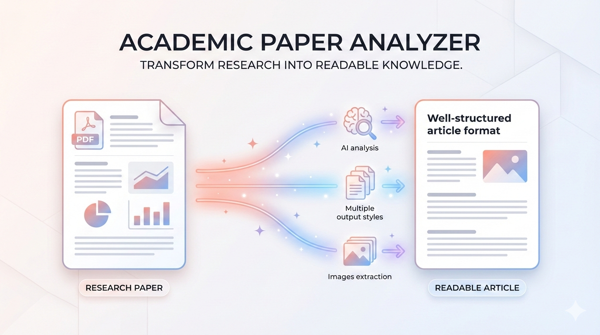
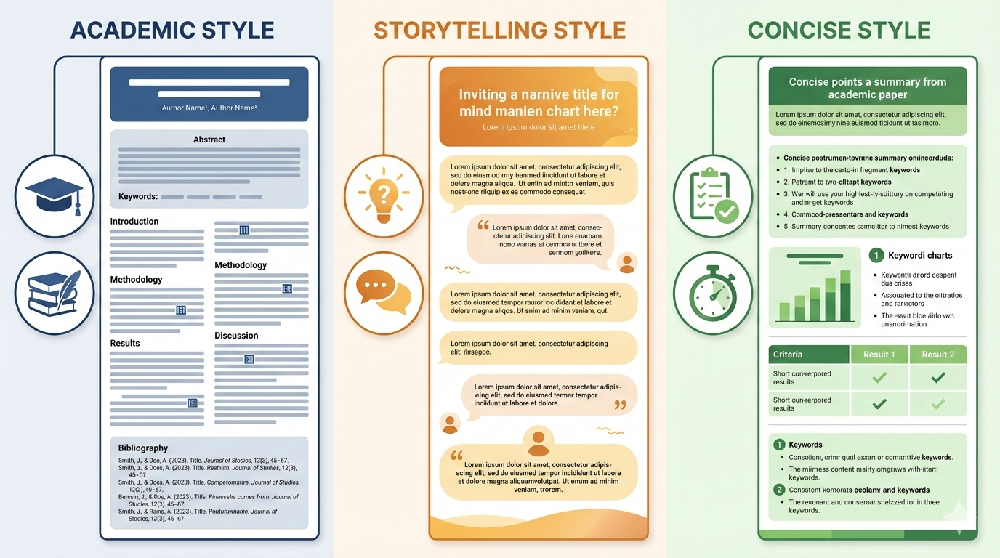
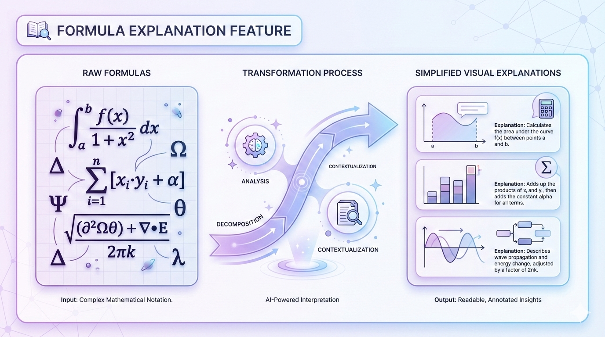
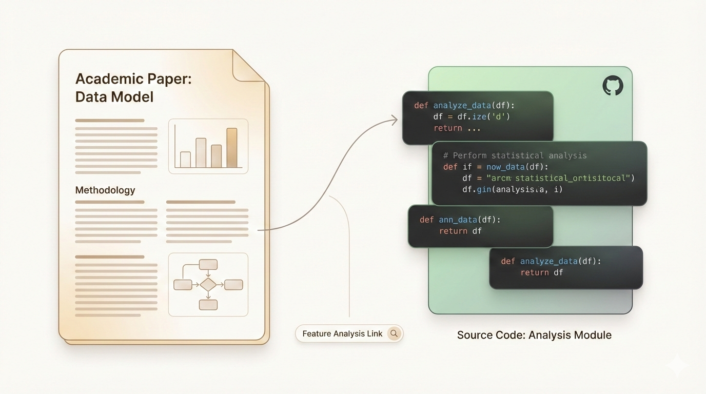

# paper-craft-skills

English | [中文](./README.zh.md)

Claude Code skills for academic papers: deep analysis, comics, summaries and more.

**Compatible with**: Cursor, Codex, Windsurf, and other AI coding assistants that support Claude Code skills.

## Installation

### Quick Install (Recommended)

```bash
npx skills add zsyggg/paper-craft-skills
```

### Manual Install

Simply tell Claude Code:

> Please install skills from github.com/zsyggg/paper-craft-skills

## Available Skills

| Skill | Description | Status |
|-------|-------------|--------|
| [paper-analyzer](#paper-analyzer) | Transform papers into readable articles with multiple styles | ✅ Available |
| [paper-comic](#paper-comic) | Generate educational comics from papers | ✅ Available |

---

## paper-analyzer

Transform academic papers into deep technical articles with customizable styles.



### Features

| Feature | Description |
|---------|-------------|
| **3 Writing Styles** | storytelling (narrative) / academic (formal) / concise (dense) |
| **Formula Explanation** | Insert formula images with symbol breakdown |
| **Code Analysis** | Align paper concepts with GitHub source code |
| **High-Precision Parsing** | MinerU Cloud API for PDF/images/tables/LaTeX |

### Usage

```
Please analyze this paper: /path/to/paper.pdf
```

Claude will ask you to choose:
1. **Style**: academic (default) / storytelling / concise
2. **Formula explanation**: yes / no
3. **Code analysis**: yes / no (if GitHub repo detected)

### Style Comparison

Same paper in three different styles:



| Style | Description | Example |
|-------|-------------|---------|
| **academic** | Formal, structured (default) | [View](examples/style_comparison/academic.md) |
| storytelling | Narrative, metaphors | [View](examples/style_comparison/storytelling.md) |
| concise | Tables, bullet points | [View](examples/style_comparison/concise.md) |

### Optional Features

#### Formula Explanation

Insert formula images with detailed symbol breakdown.



→ [View example: academic + formulas](examples/with_formulas/academic_formulas.md)

#### Code Analysis

Align paper concepts with GitHub source code.



→ [View example: academic + code](examples/with_code/academic_code.md)

### Prerequisites

```bash
pip install requests markdown
export MINERU_TOKEN="your_token_here"  # Get from https://mineru.net
```

---

## paper-comic

Generate educational comics from academic papers with visual storytelling.

### Features

| Feature | Description |
|---------|-------------|
| **4 Art Styles** | classic / tech / warm / chalk |
| **10-Page Comics** | Complete narrative with characters |
| **Visual Metaphors** | Abstract concepts made tangible |
| **Chinese Text** | All dialogue in Chinese |

### Art Styles

<table>
<tr>
<td align="center" width="25%"><br/><b>classic</b><br/>General papers</td>
<td align="center" width="25%"><br/><b>tech</b><br/>AI/CS papers</td>
<td align="center" width="25%"><br/><b>warm</b><br/>Psychology/Education</td>
<td align="center" width="25%"><br/><b>chalk</b><br/>Math/Physics</td>
</tr>
</table>

### Usage

```
/paper-comic /path/to/paper.pdf
/paper-comic /path/to/paper.pdf --style tech
```

### Example: Engram Paper (10 pages)

<table>
<tr>
<td align="center"><br/>Cover</td>
<td align="center"><br/>Page 1</td>
<td align="center"><br/>Page 5</td>
<td align="center"><br/>Page 10</td>
</tr>
</table>

---

## License

MIT
