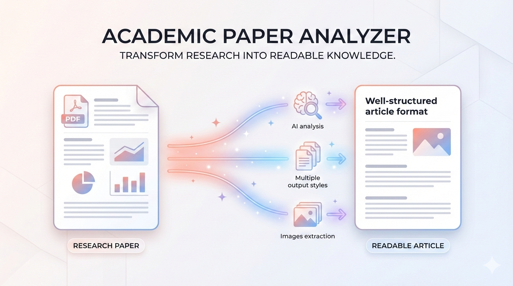
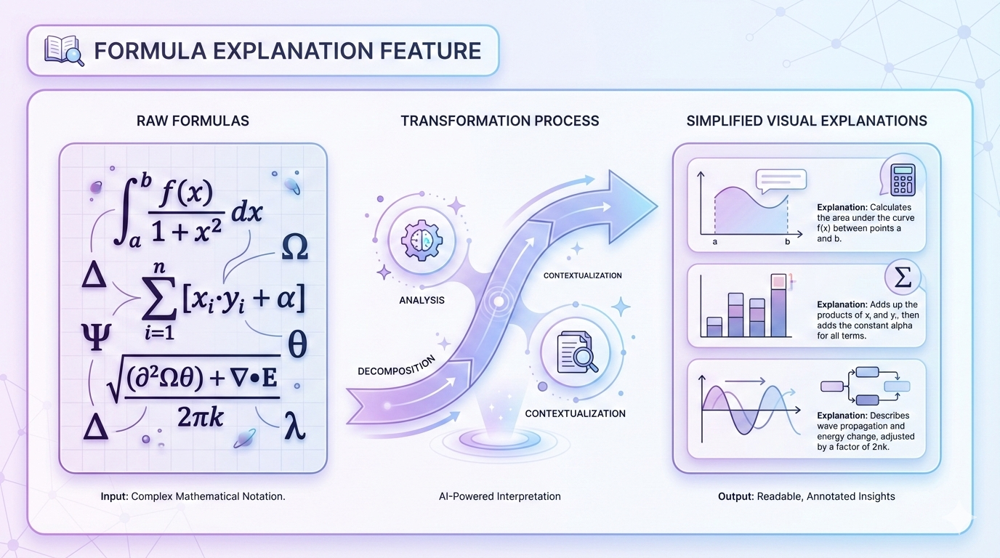
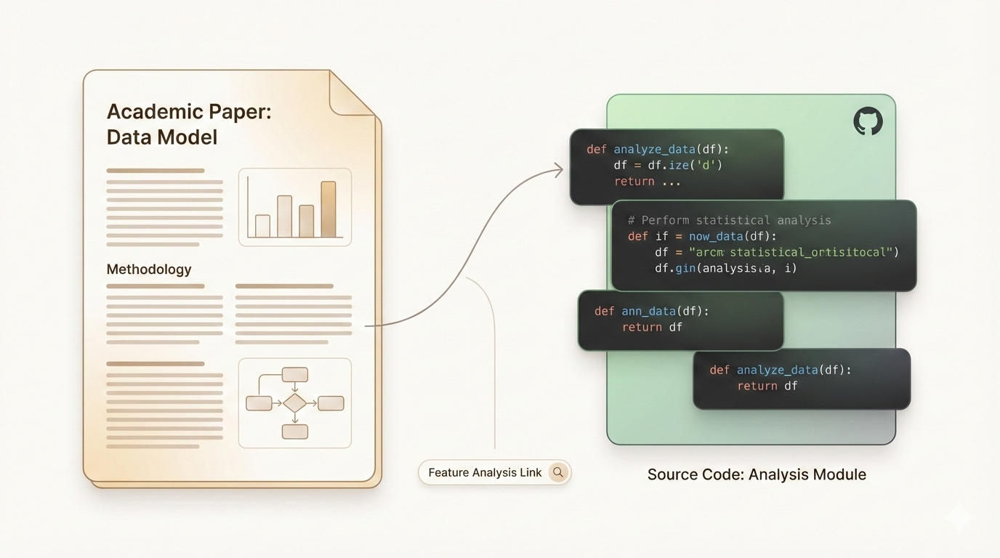

# paper-craft-skills

English | [中文](./README.zh.md)

**Turn academic papers into polished method figures and in-depth articles — zero config, one command.**

<p align="center">
  
</p>

<p align="center">
  From arxiv link to publication-ready visuals and deep-dive articles.<br/>
  Drop a paper, pick a style, get output that looks like a human expert made it.
</p>

---

## How to install

**Copy this into Codex or Claude Code:**

```
Please install zsyggg/paper-craft-skills for me.
GitHub: https://github.com/zsyggg/paper-craft-skills
```

That's it. The agent handles clone, symlink, and registration. **No API keys. No accounts.** If you prefer a terminal:

```bash
npx skills add zsyggg/paper-craft-skills
```

**Works with:** Codex · Claude Code · Cursor · Windsurf

---

## What's inside

<table>
<tr>
<td width="50%" align="center" valign="top">

### 🎨 paper-comic
**Paper → Method Figures**

<br/>
<sub>Transformer architecture — generated from <i>Attention Is All You Need</i></sub>

<br/>

Reads your paper → proposes what to draw → you confirm → generates.

| Style | Vibe |
|-------|------|
| **paper-figure** | Publication-grade diagrams |
| **sketchnote** | Bright, warm hand-drawn study notes |

</td>
<td width="50%" align="center" valign="top">

### 📄 paper-analyzer
**Paper → Deep Articles**

<br/>
<sub>Paper → polished HTML article with formulas, code cross-reference, and choice of style</sub>

<br/>

Reads the full paper → searches GitHub for code → writes in your chosen style.

| Feature | |
|---------|--|
| 🌐 Output | **HTML** — share anywhere, read on mobile |
| 📐 Formulas | **KaTeX** rendering |
| 📊 Diagrams | **Mermaid** architecture charts |
| ⚡ Setup | **Zero config** — no API keys |

</td>
</tr>
</table>

---

## paper-comic — How it works

```text
/paper-comic https://arxiv.org/abs/1706.03762

Reads the paper, then recommends:

  I suggest 6 figures:
  1. Cover: one-line contribution + visual anchor
  2. Transformer architecture overview
  3. Self-attention mechanism
  4. Multi-head attention detail
  5. Encoder / Decoder Block
  6. Key results

  Or generate only 1 overview figure, or expand to 8 detailed mechanism figures.
  Language? [Chinese / English]  Style? [sketchnote / paper-figure]  Scope and count?
```

### Example outputs

<p align="center">
  
  <br/><b>paper-figure</b> — clean, publication-grade
</p>

<p align="center">
  
  <br/><b>sketchnote</b> — bright, warm, approachable
</p>

> Full walkthrough: [examples/paper-illustrated/attention-is-all-you-need](./examples/paper-illustrated/attention-is-all-you-need)

---

## paper-analyzer — Deep articles that read like a human expert wrote them

**Not a paper translator — a re-interpreter.** It reads the full paper, searches GitHub for open-source implementations, cross-references code with the paper, and writes in your chosen style.

### Three writing styles

<p align="center">
  
</p>

| Style | Reads like | Use it for |
|-------|-----------|------------|
| **storytelling** | A viral blog post — hooks, analogies, golden takeaway | WeChat, Twitter, blogs |
| **academic** | A peer-reviewed deep dive — KaTeX formulas, comparison tables | Lab meetings, lit reviews |
| **concise** | A cheat sheet — Mermaid diagram + key data table | Quick understanding |

### Features

<table>
<tr>
<td width="50%" align="center">
<br/>
<b>Formula Explanation</b><br/>
Extracted paper formulas with symbol-by-symbol breakdown
</td>
<td width="50%" align="center">
<br/>
<b>Code Analysis</b><br/>
Aligns paper concepts with the GitHub source code
</td>
</tr>
</table>

```bash
/paper-analyzer https://arxiv.org/abs/1706.03762     # arxiv link
/paper-analyzer /path/to/paper.pdf                     # local PDF
/paper-analyzer                                         # then paste text
```

---

## License

MIT
