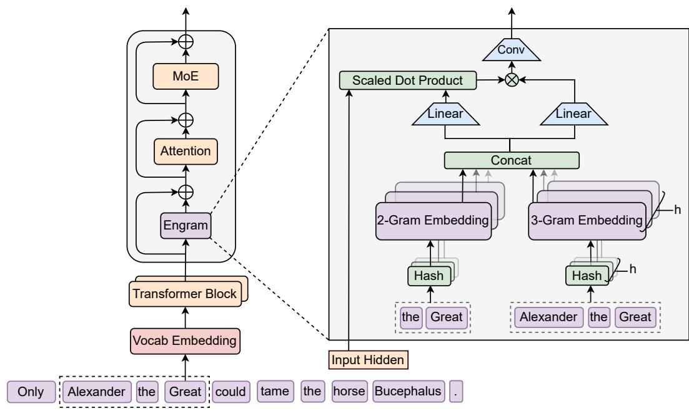
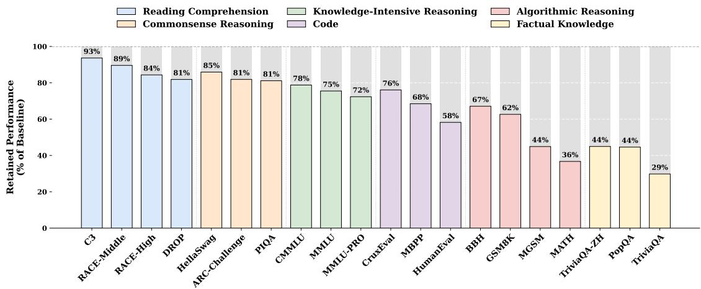
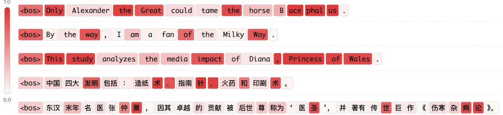
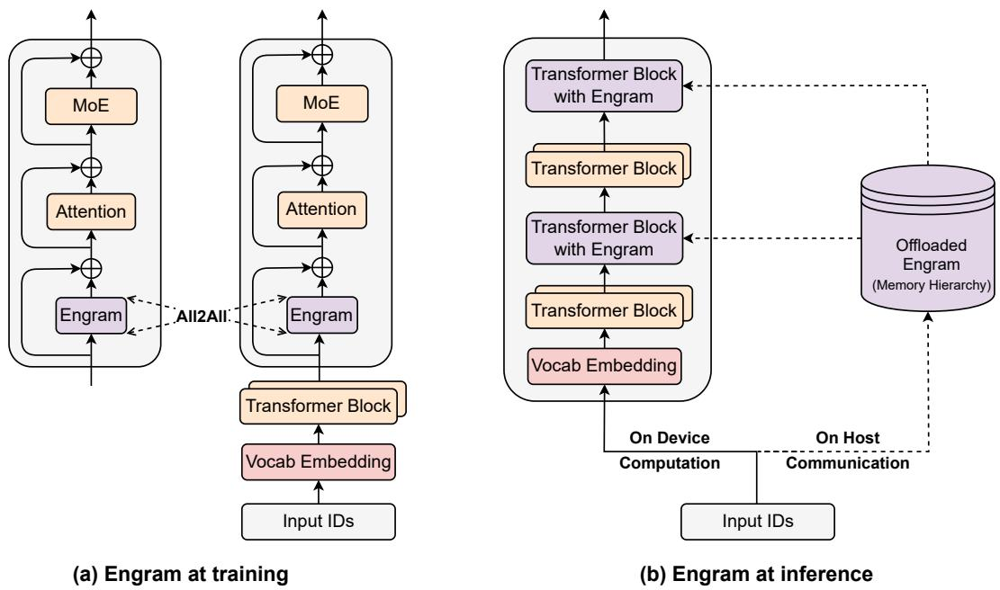

# Engram 论文速览

**论文**：Conditional Memory via Scalable Lookup: A New Axis of Sparsity for Large Language Models
**团队**：北京大学 & DeepSeek-AI | [GitHub](https://github.com/deepseek-ai/Engram)

---

## TL;DR

Transformer 引入 **O(1) 查表机制**，静态知识用查表，动态推理用计算。等参数下全面碾压 MoE 基线。

## 核心问题

| 问题 | 现状 | Engram 方案 |
|------|------|-------------|
| 计算效率 | "北京是中国首都"也要几十亿次运算 | 查表 O(1) 获取 |
| 知识更新 | 改一个知识点要重训全模型 | 模块化记忆表 |
| 内存利用 | 大量参数存静态模式 | 分离存储，按需加载 |

## 架构设计

**三步流程：**

| 步骤 | 操作 | 复杂度 |
|------|------|--------|
| 1. N-gram 检索 | 哈希映射到嵌入表 | O(1) |
| 2. 上下文门控 | 隐藏状态决定采纳度 | O(d) |
| 3. 残差融合 | 加到主干网络 | O(d) |

**关键洞见**：索引是确定性的（只依赖输入 token），支持预取和异构存储。

## 稀疏分配

| 配置 | 效果 |
|------|------|
| 100% MoE | 缺记忆模块，效率低 |
| 100% Engram | 缺计算能力，推理差 |
| **75-80% MoE + 20-25% Engram** | **最优** |

右图：纯增加 Engram 容量 → 验证损失 log-linear 下降（可无限扩展）

## 实验结果

**Engram-27B vs MoE-27B**（等参数、等 FLOPs）：

| 类别 | 基准 | 提升 |
|------|------|------|
| 知识 | MMLU | **+3.4** |
| 知识 | CMMLU | **+4.0** |
| 推理 | BBH | **+5.0** |
| 推理 | ARC-C | **+3.7** |
| 代码 | HumanEval | **+3.0** |
| 数学 | MATH | **+2.4** |
| 长文本 | NIAH | **84.2→97.0** |

## 为什么推理也提升？

**发现**：Engram 第 5 层 ≈ MoE 第 12 层（表示相似度分析）

**解释**：静态模式识别被"卸载"到查表 → 等效于**网络加深 7 层** → 更多层数用于推理

## 功能分离验证

关闭 Engram 后：
- 事实知识任务（TriviaQA）：**↓ 56-71%**
- 阅读理解任务（C3）：仅 ↓ 7-19%

→ 清晰的功能分离：Engram = 知识存储，Transformer = 上下文推理

## 门控激活可视化

高激活区域：
- 命名实体："Alexander the Great"、"the Milky Way"
- 固定搭配："By the way"、"Princess of Wales"
- 中文专名："四大发明"、"张仲景"

## 系统效率

| 特性 | 效果 |
|------|------|
| 确定性索引 | 通信模式可预测 |
| 预取优化 | 当前层算+下层取 |
| 异构存储 | CPU 存 100B 参数表 |
| **推理开销** | **仅 +3%** |

Zipf 分布优化：高频 → GPU HBM，低频 → CPU/SSD

## 核心结论

1. **架构匹配任务结构**：静态知识查表，动态推理计算
2. **等效网络加深**：释放早期层 → 更多层数用于复杂推理
3. **无限内存扩展**：增加嵌入表 = 持续提升性能（不增加 FLOPs）
4. **系统友好**：确定性索引 + 异构存储 = 大规模部署可行

---

**一句话**：记忆归记忆，计算归计算。
