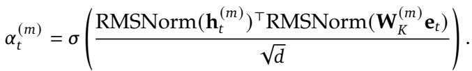
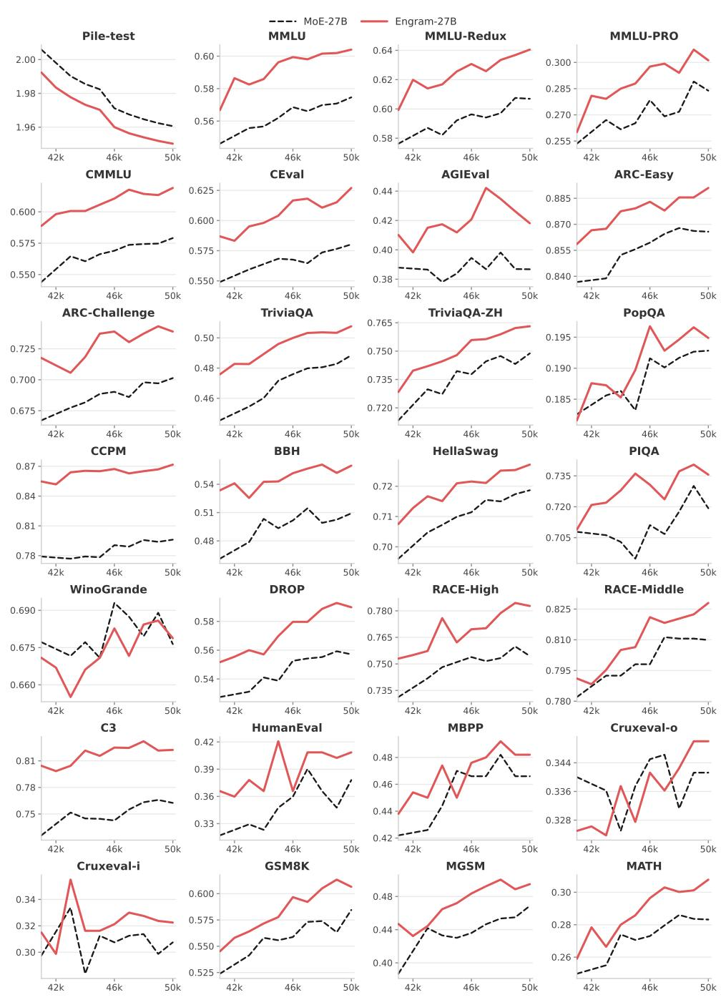
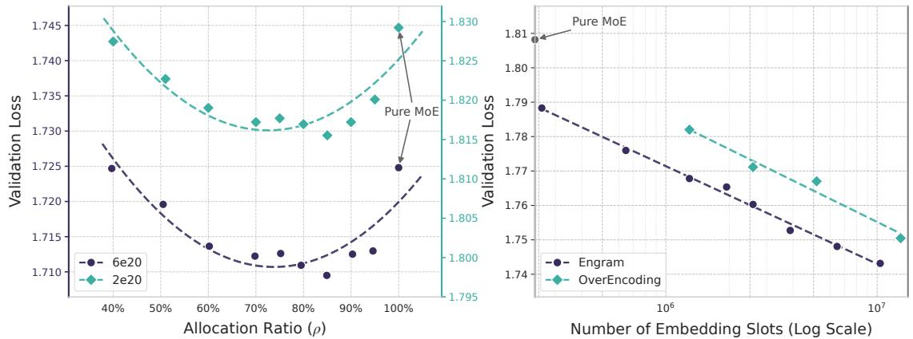

# Engram: 基于可扩展查表的条件记忆架构（公式详解版）

**论文标题**：Conditional Memory via Scalable Lookup: A New Axis of Sparsity for Large Language Models
**论文链接**：[GitHub](https://github.com/deepseek-ai/Engram)
**作者团队**：北京大学 & DeepSeek-AI

> 本文为 **academic 风格 + 公式讲解** 示例，展示如何在文章中插入公式图片并详细解读符号含义。

---

## 摘要

本文提出 Engram，一种基于条件记忆的新型稀疏架构。该方法将 N-gram 查表机制与 Transformer 主干网络相结合，实现 O(1) 复杂度的静态知识获取。

## 1. 研究背景

现有大语言模型将所有知识编码于密集参数中，推理时需激活完整的计算路径。Engram 的核心思想是：**将 N-gram 的高效查表与 Transformer 的上下文建模相结合**。

## 2. 核心公式详解

### 2.1 N-gram 哈希检索

对于位置 t 的输入 token，Engram 通过多头哈希函数将 N-gram 映射至嵌入表：

**公式**：
$$e_t = \sum_{h=1}^{H} E_h[\text{hash}_h(x_{t-k:t})]$$

**符号解读**：
| 符号 | 含义 | 说明 |
|------|------|------|
| $e_t$ | 检索得到的嵌入向量 | 最终输出，将被送入门控机制 |
| $H$ | 哈希头数 | 通常为 4-8，多头设计减少冲突 |
| $E_h$ | 第 h 个嵌入表 | 每个头有独立的嵌入表 |
| $\text{hash}_h$ | 第 h 个哈希函数 | 将 N-gram 映射为整数索引 |
| $x_{t-k:t}$ | N-gram 序列 | 当前 token 及其前 k 个 token |
| $k$ | N-gram 长度 | 通常为 2 或 3 |

**直观理解**：把"首都在"这个 3-gram 通过哈希函数变成一个数字（比如 12345），然后去嵌入表里查第 12345 行，取出对应的向量。多个头各自查表后求和。

**复杂度分析**：检索复杂度为 O(1)，与序列长度无关，这是 Engram 高效的关键。

### 2.2 上下文门控机制

查表得到的是静态信息，但语言有歧义。门控机制用当前上下文决定是否采纳记忆：

**公式**：
$$g_t = \sigma(W_g \cdot [h_t; e_t])$$
$$o_t = g_t \cdot W_v \cdot e_t$$

**符号解读**：
| 符号 | 含义 | 说明 |
|------|------|------|
| $g_t$ | 门控标量 | 取值 [0,1]，控制记忆使用量 |
| $\sigma$ | sigmoid 函数 | 将输出压缩到 [0,1] |
| $W_g$ | 门控权重矩阵 | 可学习参数 |
| $h_t$ | 当前隐藏状态 | 已通过注意力层聚合全局上下文 |
| $[h_t; e_t]$ | 向量拼接 | 将隐藏状态和记忆向量拼接 |
| $o_t$ | 门控后的输出 | 将被加到主干网络 |
| $W_v$ | 值投影矩阵 | 将记忆投影到输出空间 |

**直观理解**：
- 当 $g_t \to 1$：完全信任记忆（上下文和记忆一致）
- 当 $g_t \to 0$：忽略记忆（上下文和记忆冲突）

**例子**：讨论科技公司时检索到"苹果"是水果的嵌入，门控会趋近于 0，自动抑制这个噪声。

### 2.3 残差融合

**公式**：
$$h_t' = h_t + o_t$$

**解读**：门控后的记忆通过残差连接加到主干网络，然后继续正常的 Attention 和 FFN/MoE 计算。残差设计确保即使记忆模块失效，模型也能正常工作。

## 3. 稀疏分配公式

MoE 和 Engram 的参数分配比例直接影响性能。设总参数为 $P$：

**公式**：
$$P = P_{\text{MoE}} + P_{\text{Engram}}$$
$$\text{最优配置}: P_{\text{MoE}} : P_{\text{Engram}} \approx 75\text{-}80\% : 20\text{-}25\%$$

**解释**：
- 纯 MoE（100%）：缺乏记忆模块，用计算模拟查表，效率低
- 纯 Engram（100%）：缺乏计算能力，无法处理复杂推理
- 最优配置：两者互补，性能最佳

## 4. 实验结果

基于上述公式设计，Engram-27B vs MoE-27B（等参数、等 FLOPs）：

| 任务 | 基准 | 提升 |
|------|------|------|
| 知识 | MMLU | +3.4 |
| 推理 | BBH | +5.0 |
| 长文本 | NIAH | +12.8 |

## 5. 关键洞见

公式设计的三个关键决策：
1. **多头哈希**：降低冲突概率，提高检索质量
2. **上下文门控**：处理多义性，自动过滤噪声
3. **残差连接**：保证模型鲁棒性，便于训练

---

*本文展示了 academic 风格 + 公式讲解功能。公式讲解适合需要深入理解技术细节的读者。*
