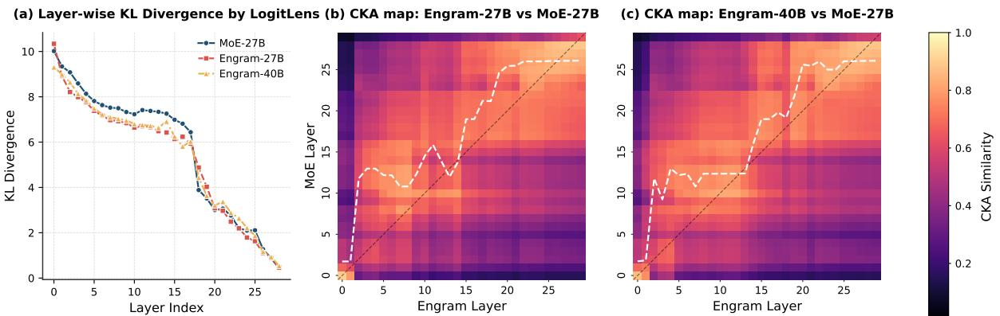

# Engram 深度解析

**论文标题**：Conditional Memory via Scalable Lookup: A New Axis of Sparsity for Large Language Models
**论文链接**：[GitHub](https://github.com/deepseek-ai/Engram)
**作者团队**：北京大学 & DeepSeek-AI

---

## 大模型其实没有"记忆"

你有没有想过这个问题：当我们问 ChatGPT "中国的首都在哪里"，它是怎么知道答案的？

直觉上，我们可能会觉得模型"记住"了这个知识，就像我们人脑一样，有个专门的地方存储着"中国首都=北京"这个信息。但实际上，大模型根本没有这样的"记忆模块"——它所有的答案都是**算**出来的。

当你输入"中国的首都在"这几个字，模型会启动一系列复杂的计算：经过几十层的 Transformer，每层都有注意力机制和前馈网络，几十亿次浮点数运算之后，模型才会为词汇表里的每个词计算出一个概率。"北京"的概率是 0.999，"深圳"可能是 0.0001，"苹果"更低。然后模型根据概率采样，输出"北京"。

这种方式有个明显的问题：**大炮打蚊子**。

"中国的首都在北京"这种常识性的知识，真的需要动用 GPU 进行几十亿次计算吗？这就像是每次查字典都要把整本字典从头背一遍——效率极低。

我们人脑可不是这么工作的。人脑有专门的海马体负责记忆，有不同的脑区负责视觉、听觉、触觉。记忆就是记忆，计算就是计算，各司其职。

那么问题来了：能不能给大模型也加上一个"记忆模块"，让它像查字典一样快速获取静态知识，而把宝贵的计算资源留给真正需要推理的任务？

DeepSeek 团队最新的 Engram 架构，就是这个思路的一个漂亮实现。

## 从 N-gram 说起：一个古老但有用的思路

要理解 Engram，我们得先回顾一个古老的技术：N-gram 语言模型。

在深度学习之前，人们是怎么做语言模型的？很简单——统计。

假设我们有一段训练语料："中国的首都在北京，中心的位置在中央..."。N-gram 模型会遍历这段文本，统计每个字后面跟着什么字的频率。

比如 1-gram（也叫 unigram）会统计：
- "中"后面跟"国"出现了 4 万次
- "中"后面跟"心"出现了 9 万次
- "中"后面跟"央"出现了 1 千次

然后做归一化，得到概率分布。

这个模型有什么问题？太蠢了。

当你问"中国的首都在哪里"，它只看最后一个字"在"，发现"在"后面跟"吃"的概率是 0.3（因为"我在吃饭"很常见），跟"北"的概率只有 0.05。于是它回答："中国的首都在吃饭"。

第二天这个模型就被约谈了。

怎么改进？看更多的上下文。2-gram 模型不再只看前一个字，而是看前两个字。"都在"后面跟"北"的概率就很高了，因为"首都在北京"是个常见搭配。这样模型就能正确回答"中国的首都在北京"。

那 3-gram、4-gram、10-gram 呢？理论上越大越好，但有个致命问题：**词汇表会爆炸**。

假设词汇表有 2 万个字，1-gram 需要存储 2 万个概率，2-gram 需要 2 万 × 2 万 = 4 亿个概率，3-gram 就是 8 万亿个。这个增长速度太可怕了，根本存不下。

所以 N-gram 模型一般只用到 2 或 3，再大就不现实了。

现在的 Transformer 架构当然比 N-gram 强大得多，它能处理任意长的上下文。但 Transformer 的问题是——它把所有事情都当成"计算"来处理，包括那些本来可以"查表"解决的简单模式。

Engram 的核心思想就是：**把 N-gram 的查表优势和 Transformer 的计算能力结合起来**。

## Engram：给 Transformer 装上"海马体"

Engram 的设计非常优雅。它在 Transformer 的特定层插入一个"条件记忆模块"，工作原理如下：

**第一步：提取 N-gram 并查表**

对于当前位置的 token，Engram 会提取它前面 2-3 个 token 组成的 N-gram（比如"首都在"），然后用哈希函数把这个 N-gram 映射到一个巨大的嵌入表中，取出对应的向量。

这个过程是 O(1) 复杂度——不管你的嵌入表有多大，查表时间都是常数。这和 Transformer 的 O(n) 或 O(n²) 复杂度形成鲜明对比。

**第二步：上下文感知的门控**

查表得到的是"静态"信息，但语言是有歧义的。比如"苹果"可能指水果，也可能指公司。怎么办？

Engram 用当前的隐藏状态（已经通过前面的注意力层聚合了全局上下文）作为 Query，查表得到的嵌入作为 Key/Value，计算一个门控值。如果查到的记忆和当前上下文矛盾（比如在讨论科技公司时查到了水果相关的嵌入），门控值会趋近于零，自动抑制这个噪声。

**第三步：融合到主干网络**

最后，门控后的记忆通过残差连接加到主干网络中，然后继续正常的 Attention 和 MoE 计算。

整个设计的精髓在于：**记忆归记忆，计算归计算**。静态的模式通过查表获取，动态的推理交给 Transformer。两者各司其职。

## U 型曲线：MoE 和 Engram 应该怎么分配？

现在有个实际问题：在固定的参数预算下，应该把多少分给 MoE 专家，多少分给 Engram 记忆？

DeepSeek 团队做了系统的实验，发现了一个有趣的 **U 型曲线**：

- **纯 MoE**（100% 给专家）：模型缺乏专门的记忆模块，被迫用计算来模拟查表，效率低
- **纯 Engram**（100% 给记忆）：模型失去条件计算能力，无法处理需要动态推理的任务
- **最优配置**（约 75-80% 给 MoE，20-25% 给 Engram）：性能最佳

这个发现很实用：它告诉我们，简单的查表机制如果被当作一等公民来设计，可以成为神经计算的重要补充。

右边的图更有意思：在"无限内存"场景下（只增加 Engram 容量，不增加计算），验证损失呈现 log-linear 的下降趋势。这意味着 Engram 是可以持续扩展的——只要你有足够的内存，就能持续提升性能，而且不会增加推理时间。

## 实验结果：出乎意料的全面提升

基于最优分配法则，DeepSeek 训练了 Engram-27B，和 MoE-27B 严格等参数、等 FLOPs 对比。结果令人惊喜：

| 任务类型 | 代表性基准 | 提升幅度 |
|----------|------------|----------|
| 知识密集 | MMLU +3.4, CMMLU +4.0 | 符合预期 |
| 通用推理 | BBH +5.0, ARC-Challenge +3.7 | **超出预期** |
| 代码/数学 | HumanEval +3.0, MATH +2.4 | **超出预期** |
| 长上下文 | Multi-Query NIAH 84.2→97.0 | **惊人** |

知识任务的提升是意料之中的——毕竟 Engram 本质上就是个知识库。但推理和代码任务的提升反而更大，这就值得深思了。

## 为什么推理也能受益？等效于加深网络

这是论文最精彩的分析部分。

想象一下：当你问模型"Diana, Princess of Wales"是谁，模型需要经过好几层才能把"Wales"从"英国的一个地区"逐渐组合成"戴安娜王妃"这个完整概念。这个过程论文用了一个很形象的例子：

| 层数 | 隐状态翻译 | 解释 |
|------|------------|------|
| 1-2 | Country in the United Kingdom | Wales（地名） |
| 3 | Country in Europe | Wales（地名） |
| 4 | Title held by female sovereigns... | Princess of Wales（头衔） |
| 5 | Title given to the wife of Prince... | Princess of Wales（头衔） |
| 6 | Diana, Princess of Wales (1961-1997)... | 戴安娜王妃（实体） |

模型需要消耗 6 层才能"认出"这个实体。但如果有 Engram，这个工作可以通过查表直接完成，省下来的层数就可以用来做更复杂的推理。

团队用两个工具验证了这个假设：

**LogitLens 分析**（左图）：测量每一层的隐状态离最终预测有多远。Engram 模型在早期层就达到了低 KL 散度，说明特征组合完成得更快。

**CKA 相似度分析**（中、右图）：比较 Engram 和 MoE 不同层之间的表示相似度。结果显示，Engram 第 5 层的表示相当于 MoE 第 12 层的表示——**等效于把网络加深了 7 层**。

这就解释了为什么推理任务也能受益：Engram 把静态模式的重建工作从早期层卸载了，相当于"免费"增加了网络深度，让模型有更多"层数"来做复杂推理。

## 记忆和推理的功能分离

一个自然的问题：Engram 真的在做"记忆"的工作吗？还是只是另一种形式的计算？

团队做了一个巧妙的实验：在推理时完全关闭 Engram 模块，看模型性能会掉多少。

结果非常清晰：
- **事实知识任务**（TriviaQA 等）：性能暴跌到只剩 29-44%
- **阅读理解任务**（C3 等）：性能保持在 81-93%

这说明 Engram 确实承担了"知识存储"的功能，而阅读理解这种依赖上下文的任务主要靠 Transformer 的注意力机制。两者功能分离得非常清晰。

## 门控可视化：Engram 在识别什么模式？

论文还展示了门控机制的可视化：

红色表示门控激活强度。可以看到：
- 英文中，Engram 在命名实体（"Alexander the Great"、"the Milky Way"）和固定搭配（"By the way"、"Princess of Wales"）上强烈激活
- 中文中，Engram 识别成语（"四大发明"）和历史人物（"张仲景"）

这些都是典型的"静态模式"——一旦出现就有固定含义，不需要动态推理。Engram 成功地把这些模式从 Transformer 中"卸载"出来了。

## 系统效率：100B 参数表只增加 3% 开销

Engram 还有个工程上的巨大优势：**基础设施友好**。

和 MoE 的动态路由不同，Engram 的查表索引是**确定性**的——只取决于输入 token，不依赖隐藏状态。这意味着：

1. **可以提前预取**：在当前层计算的同时，系统就可以预取下一个 Engram 层需要的嵌入
2. **通信和计算重叠**：即使嵌入表放在 CPU 内存中，也可以把数据传输和 GPU 计算并行起来

实验显示，把 100B 参数的嵌入表完全放在 CPU 内存中（通过 PCIe 传输），推理吞吐量只下降了不到 3%。这意味着 Engram 可以突破 GPU 显存限制，激进地扩展参数规模。

考虑到自然语言的 Zipf 分布（少量高频模式占据大部分文本），还可以进一步优化：把热门嵌入缓存在 GPU HBM 中，冷门嵌入放在 CPU 内存甚至 SSD 中。这样就能用有限的硬件支撑超大规模的记忆表。

## 思考与展望

Engram 给我最大的启发是：**架构设计应该匹配任务的内在结构**。

语言建模本质上是异构的——有些知识是静态的、可查表的（实体、成语、固定搭配），有些推理是动态的、需要计算的（逻辑推理、数学证明）。用统一的计算来"模拟"一切，不如把两类任务分开处理。

这个思路其实和人脑的分工很像。海马体负责记忆，前额叶负责推理，不同脑区各司其职。Engram 可以看作是给 Transformer 装上了一个"人工海马体"。

论文的 U 型曲线也很有意思：它暗示了一个"最优稀疏性配比"的存在。这个配比可能和训练数据的统计特性有关——Zipf 定律告诉我们，少量高频模式占据了大部分文本，这些模式天然适合用查表来处理。

更让我期待的是这个思路的扩展性。目前 Engram 只用在语言模型上，但视觉模型、多模态模型是不是也有类似的"静态模式 vs 动态推理"的区分？比如物体识别可能更像查表（这是一只猫），而场景理解可能更需要推理（这只猫在追一只老鼠）。

PS: 从工程角度看，Engram 的确定性索引是个很聪明的设计。相比 MoE 的动态路由，确定性索引让通信模式变得可预测，这对分布式系统的优化非常友好。期待看到 DeepSeek 在下一代模型中如何应用这个技术。

总结一句话：**记忆归记忆，计算归计算**。

---

*本文基于 DeepSeek-AI 团队的论文 "Conditional Memory via Scalable Lookup: A New Axis of Sparsity for Large Language Models" 整理，代码已开源：https://github.com/deepseek-ai/Engram*
